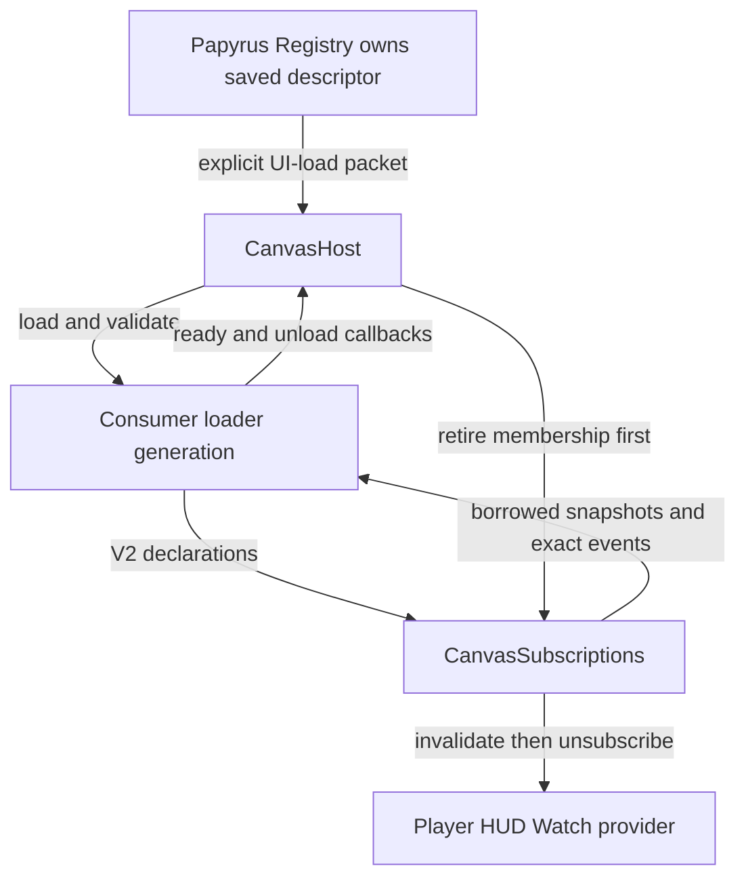

# Canvas consumer descriptor contract

This document defines the developer-facing contract between a Canvas host movie and a loaded consumer movie. It covers the persistent Papyrus registration record, the explicit UI-load packet, the version 1 and version 2 loaded-child handshake, shared Player HUD data subscriptions, and Papyrus-origin named Canvas events.

The authoritative implementation is [Registry.psc](../Papyrus/Venworks/Canvas/Registry.psc), [Enumerations.psc](../Papyrus/Venworks/Canvas/Enumerations.psc), [CanvasHost.as](../Scaleform/canvas/actionscript/CanvasHost.as), and [CanvasSubscriptions.as](../Scaleform/canvas/actionscript/CanvasSubscriptions.as). The bundled [Example](../Scaleform/canvas/actionscript/CanvasExample.as) and [Component Gallery](../Scaleform/canvas/actionscript/CanvasComponentGallery.as) movies are representative version 2 consumers.

## Separate version boundaries

Canvas uses four version concepts with different responsibilities.

- The descriptor revision is the positive `version` stored in the native registration record and identifies the consumer's asset or configuration revision. It must match the revision in the UI-load packet and the loaded movie handshake.
- The consumer protocol is `VWCANVAS_CONSUMER/1` or `VWCANVAS_CONSUMER/2` and describes the fields and callbacks a loaded movie provides.
- The wire envelope is `VWC_EVT/1|`; its packet type is selected by Canvas-owned enum values such as `canvas.ui.load` and `canvas.event`.
- The negotiated host API is the `contractVersion` selected from a version 2 consumer's minimum and maximum range. The current host selects API version `2` when the range includes `2`.

Do not use the descriptor revision as an API version. Changing a movie asset or its configuration can increment the descriptor revision without changing the consumer protocol or host API.

## Registration and UI loading

Registration and UI loading are two explicit Papyrus operations. A registrar calls `TryRegisterConsumer(Self, consumerId, displayName, normalMovieUrl, largeMovieUrl, descriptorVersion)` and, after an accepted registration receipt, calls `TryRequestUiLoad(Self, consumerId)`. Registration does not itself publish to the UI bridge, and a successful registration or queued load does not mean that the movie is ready or rendered.

The compatibility wrappers `RegisterConsumer` and `RequestUiLoad` remain available. The boolean registration wrapper treats only `REGISTRATION_ACCEPTED`, `REGISTRATION_UPDATED`, and `REGISTRATION_UNCHANGED` as success; the explicit `Try...` functions provide the distinct deferred and rejection statuses needed by new callers.

### Persistent registration record

The saved `Consumers` array contains one `ConsumerRegistration` record per consumer. The record has the following fields.

| Field | Type | Current contract |
| --- | --- | --- |
| `Owner` | `Quest` | Must be available at registration. The same owner may update a matching UUID; a different owner receives `REJECTED_OWNER_MISMATCH`. |
| `ConsumerId` | `String` | Must be a valid, non-nil UUID. Accepted loader forms are dashed 36-character, brace-wrapped 38-character, or compact 32-hex UUIDs; Canvas stores and routes the normalized lower-case dashed value. |
| `DisplayName` | `String` | One to 80 printable ASCII characters. It is registry metadata and is not included in the UI-load packet. |
| `NormalMovieUrl` | `String` | One to 180 printable ASCII characters using `VenworksCanvas/Consumers/<namespace>/normal.swf`. |
| `LargeMovieUrl` | `String` | One to 180 printable ASCII characters using the same namespace and the `large.swf` suffix. |
| `DescriptorVersion` | `Int` | An integer from 1 through 9999 that identifies the consumer asset/configuration revision. |

The movie namespace is 3 through 64 characters, begins and ends with an ASCII letter or digit, permits ASCII letters, digits, hyphens, and single dots internally, and rejects consecutive dots. The normal and large paths must use one identical namespace under a case-insensitive comparison. Canvas does not generate a consumer identity.

`None` owners, invalid or nil UUIDs, empty or non-ASCII display names, invalid paths, and descriptor revisions outside `1..9999` are rejected. The native registry repairs only missing `Consumers` storage and removes null or ownerless saved rows; it does not replace valid records or migrate descriptor metadata automatically.

### UI-load packet

Canvas emits the canonical packet `VWC_EVT/1|canvas.ui.load|` followed by five adjacent decimal-length-prefixed fields. A frame is `<character-count>:<contents>`.

```text
VWC_EVT/1|canvas.ui.load|<1:protocol><uuid-length:consumer-id><version-length:descriptor-version><path-length:normal-path><path-length:large-path>
```

The fields are protocol `1`, normalized consumer UUID, descriptor revision, normal movie path, and large movie path. The complete packet is printable ASCII and no more than 512 characters. The host accepts the envelope prefix with ASCII case folding for compatibility, validates every frame and rejects trailing data, then canonicalizes the accepted namespace paths for loading. Display names and version 2 subscription metadata are not saved in or carried by this packet.

## Loaded-child handshake

After the host loads the selected normal or large movie, it requires `getCanvasRegistration()` and validates the returned object before the movie can become ready. A version 1 declaration checks its protocol, normalized consumer UUID, and integer descriptor revision only; `assetNamespace` is ignored for version 1. A version 2 declaration additionally derives the expected `assetNamespace` from the loaded movie path and checks that namespace and the descriptor revision against the UI-load packet.

### Version 1

The legacy declaration retains load and disposal behavior and does not opt into data or event delivery.

```actionscript
public function getCanvasRegistration() : Object
{
   return {
      "protocol":"VWCANVAS_CONSUMER/1",
      "consumerId":"a8098c1a-f86e-4b1e-9d7c-5a102bf38460",
      "version":1
   };
}
```

The host validates only the version 1 protocol, normalized UUID, and integer descriptor revision, reports `contractVersion` 1 internally, and ignores `assetNamespace` for version 1. It does not require version 2 callbacks. A version 1 movie can optionally expose `dispose()` for cleanup; the host invokes it when present during unload.

### Version 2 declaration

The version 2 object has these required metadata fields.

| Field | Type | Current contract |
| --- | --- | --- |
| `protocol` | `String` | Exactly `VWCANVAS_CONSUMER/2`. Other or missing protocol values are rejected. |
| `consumerId` | `String` | Must normalize to the UUID assigned to the loaded loader. `null`, another UUID, and a malformed or nil UUID are rejected. |
| `assetNamespace` | `String` | Must case-insensitively match the safe namespace derived from the loaded movie path. Missing, `null`, or another namespace is rejected. |
| `version` | `Number` | A finite numeric integer from 1 through 9999 that exactly matches the native descriptor revision. Strings, booleans, fractions, `NaN`, infinity, missing values, `null`, and out-of-range numbers are rejected. |
| `minimumContractVersion` | `Number` | A finite numeric integer from 1 through 9999. The declared range must include host API version 2. |
| `maximumContractVersion` | `Number` | A finite numeric integer from 1 through 9999, greater than or equal to the minimum, and at least 2. |
| `uiChannels` | `Array` | Zero or more exact names from the approved catalog, with no duplicate entries and no more than 18 entries. Missing, `null`, non-array, unknown, wrong-case, non-string, duplicate, or over-limit values are rejected. |
| `eventTopics` | `Array` | Zero or more valid topic strings, with no duplicate entries and no more than 16 entries. Missing, `null`, non-array, non-string, duplicate, reserved, malformed, or over-limit values are rejected. |

The host currently ignores extra keys in the returned object. Extra keys do not add features, select callback names, or change validation; consumers should rely only on the fields documented here.

A minimal version 2 consumer looks like this.

```actionscript
public function getCanvasRegistration() : Object
{
   return {
      "protocol":"VWCANVAS_CONSUMER/2",
      "consumerId":"a8098c1a-f86e-4b1e-9d7c-5a102bf38460",
      "assetNamespace":"venworks.canvas.example",
      "version":1,
      "minimumContractVersion":2,
      "maximumContractVersion":2,
      "uiChannels":["PlayerData"],
      "eventTopics":["venworks.canvas.example.ping"]
   };
}

public function handleUIData(channel:String, snapshot:Object) : void
{
}

public function handleCanvasEvent(topic:String, body:String) : void
{
}

public function handleLifecycle(state:String, context:Object) : void
{
}
```

Version 2 requires all three fixed callbacks as functions: `handleUIData(channel, snapshot)`, `handleCanvasEvent(topic, body)`, and `handleLifecycle(state, context)`. The declaration cannot provide callback names or arbitrary methods. A missing callback, a non-function value, an incompatible range, an invalid list, or an identity/revision mismatch prevents the movie from becoming ready and unloads that movie independently.

### Negotiation and lifecycle

The current host selects API version 2 when `minimumContractVersion <= 2 <= maximumContractVersion`. A range such as `1..1` or `3..3` is incompatible. The selected version and feature set are discovered through the ready lifecycle context.

```actionscript
{
   "contractVersion":2,
   "features":["uiData","canvasEvents","lifecycle"],
   "uiChannels":["PlayerData"],
   "eventTopics":["venworks.canvas.example.ping"]
}
```

The context is a plain capability description. It contains no host object, loader, timer, callback handle, or arbitrary context handle, and extra context fields are not promised. The fixed callback signatures are `handleUIData(channel:String, snapshot:Object) : void`, `handleCanvasEvent(topic:String, body:String) : void`, and `handleLifecycle(state:String, context:Object) : void`; Canvas does not negotiate callback names or provide a consumer-to-Papyrus callback.

The host installs routing during the initialization phase, before the ready callback, so a provider that replays synchronously cannot lose ownership. It calls `handleLifecycle("ready", context)` after validation and then marks the membership ready; any latest snapshot already observed for a requested channel is delivered after the ready callback. A data or event callback is never delivered to a version 2 movie before it is ready. Readiness is a single transition for one loader generation; a duplicate completion or ready signal cannot create a second membership, ready callback, or snapshot replay. Internally, the normal progression is `loading` -> `initializing` -> `initialized` -> `completing` -> `ready`; validation or a ready lifecycle callback that throws any value unloads the affected generation, while a data or event callback that throws any value is reported and leaves the current membership eligible for later delivery. Removal can tear it down from any state.

On unload, Canvas removes the consumer's routing membership first, calls `handleLifecycle("unload", context)` when the movie was version 2, invokes `dispose()` when present, removes the loader, and closes/unloads it. Thrown values from the unload callback or `dispose()` are caught so the remaining teardown steps proceed. Loader identity and generation checks make callbacks from an obsolete loader inert. Removing the host movie from the HUD invokes host disposal, which tears down the bridge and all loaded consumers; Canvas has no suspension or resume lifecycle. A reopened HUD creates a new host and new loader generations.



The transition table makes packet and lifecycle ordering explicit.

| Signal or condition | Host transition | Result |
| --- | --- | --- |
| A valid UI-load packet omits another currently loaded consumer | Reconcile only the packet's consumer ID | The omitted consumer remains loaded; a valid load packet is not a removal command. |
| A UI-load packet repeats the same normalized ID, path, and descriptor revision | Keep the current loader and generation | No duplicate loader, subscription membership, ready callback, or native submission is created. |
| A UI-load packet changes the path or descriptor revision | Retire the current loader and routing membership before creating the replacement generation | The old movie is unloaded; callbacks from it are inert, and the replacement must pass its own handshake. |
| A UI-load packet frame is missing, null, malformed, or out of range | Reject the packet before reconciliation | The current loader remains unchanged because no replacement starts. |
| A required V2 declaration field is missing, null, malformed, or out of range | Reject the loaded generation at handshake validation and unload that generation | The movie does not become ready; if it replaced an older loader, the older loader was already retired and is not promised to remain loaded. |
| A V2 provider is unavailable or a requested channel subscription fails | Roll back memberships created for that load and unload the affected consumer | Other consumers and their channel memberships continue independently. |
| A provider replays before readiness | Retain only the latest channel snapshot without delivering it to the consumer | The retained snapshot is delivered after the single ready callback. |
| A late or out-of-order provider, completion, error, or timer signal arrives after channel or loader retirement | Apply the relevant ownership check: channel and callback identity for provider data, loader and generation for loader signals, or activation epoch and ticket for UI timers | The signal is ignored and cannot resurrect the old consumer or submit old UI work. |
| A duplicate completion or ready signal arrives for the current generation | Preserve the existing ready state | No second ready callback, membership, or initial snapshot replay occurs. |
| An event arrives before readiness or has no exact ready topic subscriber | Perform exact routing against current ready memberships | The event is discarded with no queue, replay, or delivery receipt. |
| HUD removal or host disposal occurs | Invalidate routing, unsubscribe, unload consumers, and release host resources | The lifecycle ends at `unload`; suspension and resume are unsupported. |

Required fields and optional state have different null and missing behavior. A missing or `null` V2 metadata field is invalid; an empty `uiChannels` or `eventTopics` array is valid and requests no entries. A missing optional `dispose()` function is valid. An event body may be the empty string, while a missing or `null` body is invalid. For provider data, a callback payload may be `null` and still counts as an observed snapshot; Canvas tracks that case separately from having observed no snapshot. If a provider callback has no `data` wrapper, Canvas treats the payload itself as the snapshot; if the wrapper is present, its `data` value is used, including `null`.

UI loads and named events share one monotonic serial ticket space and one one-second native submission gate. A positive ticket owns pending UI pump work and can expire or be released after its bounded retry window; releasing positive ownership cannot clear a negative ticket. Once a UI load or event is reserved, the negative ticket remains owned through the native call or activation cancellation and its one-second cleanup. Ordinary deferrals do not restart or replace that negative owner. A changed HUD activation may reschedule cleanup only for a matching completed ticket; exhausted cleanup remains fail-closed because no timestamp-based reclaim is safe.

## UI data subscriptions

The host uses the Player HUD Watch data manager after the vanilla Watch subscriptions have been restored. Watch presentation and alert animation are disabled while that shared data manager remains available. One Canvas subscription is created for each distinct requested channel, and multiple consumers share that provider callback.

The current approved catalog is exact and case-sensitive.

- `LocalEnvironmentData`
- `LocalEnvData_Frequent`
- `PlayerData`
- `PlayerFrequentData`
- `PlayerInventoryData`
- `WeaponData`
- `HudJetpackData`
- `HUDStarbornPowersData`
- `FavoritesData`
- `ControlMapData`
- `EnvironmentEffectsData`
- `PersonalEffectsData`
- `StarmapSystemBodyInfoProvider`
- `HudCompassData`
- `HudCrosshairData`
- `HUDStealthData`
- `HUDVehicleData`
- `HUDOpacityData`

The catalog preserves the current VWHUD workload of 18 distinct data channels across 24 request sites. The 18-channel declaration limit and the 16-topic declaration limit are enforced contract limits, not measured performance targets.

Provider replay and delivery follow these rules.

- Canvas captures one exact callback function per channel and records membership and callback ownership before calling `Subscribe`, because a ready provider can invoke that callback synchronously.
- Before readiness, Canvas retains only the latest provider snapshot for each distinct channel. A new consumer receives those latest snapshots after its ready lifecycle callback. This retained value belongs to the current host movie lifetime; it is cleared when the final channel membership is retired or the host is disposed.
- After readiness, each provider update is sent only to current consumers that requested that exact channel. The callback rechecks that the channel is still subscribed and that the exact captured callback is still current after reading the provider payload and before retaining the snapshot or dispatching it. The snapshot is borrowed data; consumers should treat it as read-only and must not assume that the host enforces deep immutability or makes an immutable copy. Consumer-local state, such as a marker or an event-received flag, remains owned by the loaded movie and is not retained by Canvas.
- Recipient lists are copied for a dispatch. A consumer can unload during another consumer's callback without preventing remaining recipients from receiving the update.
- A data or event callback that throws any value, including a value that is not an `Error`, is caught and reported for that consumer; it does not abort delivery to other current recipients or remove that membership. Canvas has no mechanism to cancel a callback that does not return.
- Removing the final consumer of a channel first invalidates the local subscribed flag, callback identity, and retained snapshot, then calls `Unsubscribe`; delayed or reentrant callbacks that do not match the current ownership are ignored. A failed provider subscription rolls back the new consumer's earlier memberships and that consumer is unloaded.

## Named Canvas events

Papyrus publishes one temporary event with `Registry.TryPublishCanvasEvent(eventTopic, body)`. The publisher does not need to own or register a consumer. The topic is a routing key, and its namespace does not authenticate the publisher.

```papyrus
; The caller owns a Venworks:Canvas:Registry property named Registry.
String eventTopic = "venworks.canvas.example.ping"
String body = "hello from Papyrus"
OperationResult receipt = Registry.TryPublishCanvasEvent(eventTopic, body)
; Inspect receipt.Status. EVENT_SUBMITTED means native submission only.
```

The bundled registrars demonstrate registration and UI loading; they do not automatically publish events. The Example also exposes the explicit `cgf "Venworks:CanvasExamples:ExampleRegistrar.ConsolePing"` command, which resolves its packaged registrar and makes one publication attempt through the configured Canvas registry. Run it after the Example movie is visibly ready. That movie's handler responds to `venworks.canvas.example.ping` by displaying lowercase `pong`, independent of the body contents, and retains the result through subsequent provider updates until the movie unloads. Component Gallery handles the same topic by displaying an event-body marker. This illustrates that each consumer declares its topics and supplies its own ActionScript behavior; Canvas routes the event without interpreting its meaning. The snippet above remains an integration example for a Papyrus script that already has a valid Canvas registry reference. The direction is Papyrus to the UI bridge only: Canvas does not call back into Papyrus, and `EVENT_SUBMITTED` is not an acknowledgement from a consumer or from the renderer.

### Topic and body rules

Topics are 3 through 96 printable ASCII characters with at least two dot-separated segments. Each segment begins and ends with an ASCII letter or digit and may contain ASCII letters, digits, hyphens, and underscores internally. The reserved `canvas.` prefix is rejected case-insensitively. Accepted topic and body case is preserved, and topic routing is exact and case-sensitive.

Bodies are 0 through 400 printable ASCII characters. An empty string is valid; `None`, control characters, non-ASCII characters, and longer bodies are rejected. Canvas does not parse, normalize, or interpret the body.

The complete event packet must also be printable ASCII and no more than 512 characters. The individual topic and body maxima therefore cannot always be combined. For example, a 96-character topic made by `a.` followed by 94 `b` characters fits with an empty body; with that topic, a 383-character body makes an exact 512-character packet and a 384-character body makes a 513-character packet that is rejected.

### Event wire format

Canvas owns the wire selectors and emits `VWC_EVT/1|canvas.event|` followed by three adjacent decimal-length-prefixed fields: protocol `1`, topic, and body.

```text
VWC_EVT/1|canvas.event|1:1<topic-length:topic><body-length:body>
```

For example, the body `hello` and topic `venworks.canvas.example.ping` produce the shape below; the frame contents are not separated by an additional delimiter.

```text
VWC_EVT/1|canvas.event|1:128:venworks.canvas.example.ping5:hello
```

The host validates the complete packet, protocol, frames, topic grammar, reserved namespace, and absence of trailing data before routing. The envelope prefix is accepted with ASCII case folding, while the topic and body values are preserved exactly.

### Publication receipts

`TryPublishCanvasEvent` returns a per-call `OperationResult`. The event statuses are as follows.

| Status | Meaning |
| --- | --- |
| `REJECTED_EVENT_ARGUMENTS` | The topic or body failed its type, character, namespace, or individual length validation. |
| `REJECTED_EVENT_PACKET` | The individually valid fields produced a non-printable or over-512-character packet. |
| `REJECTED_EVENT_INACTIVE` | The Player HUD is inactive or its activation change has not been applied. |
| `DEFERRED_EVENT_BUSY` | The nonblocking registry guard was busy. |
| `DEFERRED_EVENT_UI_PENDING` | A UI-load pump or unsent UI-load entry has priority over this event. |
| `DEFERRED_EVENT_RATE_LIMIT` | The shared one-second native submission gate is occupied. |
| `EVENT_RESERVED` | Internal reservation state before the native call; callers should not expect this as the final returned status. |
| `EVENT_CANCELLED_ACTIVATION` | The activation epoch changed after reservation, so Canvas did not submit the packet. |
| `EVENT_SUBMITTED` | Canvas called the native Watch submission function for this packet. This confirms native submission only, never consumer delivery or rendering. |

UI loads and named events share one one-second submission gate, and pending UI work takes priority. Publication is one-shot: Canvas does not queue, retain, retry, acknowledge, or replay an event. An event sent before a consumer is ready or to a topic with no exact ready subscribers is lost.

## Enforced aggregate limits

These limits describe the current implementation and its bounded in-memory routing state.

| Resource | Limit | Unit and consequence |
| --- | --- | --- |
| Version 2 consumer memberships | 32 | Simultaneous loaded consumer memberships admitted by `CanvasSubscriptions`. |
| UI channel declarations per consumer | 18 | Entries in one `uiChannels` array, selected from the exact catalog. |
| Event topic declarations per consumer | 16 | Entries in one `eventTopics` array. |
| Channel memberships | 576 | Derived maximum of 32 consumers multiplied by 18 channels. |
| Topic memberships | 512 | Derived maximum of 32 consumers multiplied by 16 topics. |
| Recipients per dispatch | 32 | At most one delivery per current consumer membership for an exact channel or topic. |
| Retained provider snapshots | 18 | At most one latest snapshot for each distinct approved channel. |
| Event topic length | 96 | Printable ASCII characters, including the topic frame contents only. |
| Event body length | 400 | Printable ASCII characters, including the body frame contents only. |
| Complete event packet | 512 | Printable ASCII characters, including the envelope, packet type, and frame syntax. |

The list and packet limits above are native Canvas contract limits, not PC, PS5, Flash, Scaleform, or HTML rendering budgets. HTML Engine numeric ceilings are outside this contract and remain unmeasured by this change.

## Specification and acceptance vectors

The following vectors are specification and review cases for the current contract. They describe valid and invalid boundaries for an implementation or a manual test; they are not an executable Papyrus, ActionScript, Scaleform, Watch, timer, or Starfield runtime model. The common-path and diagnostic-consumer procedure is maintained in the [VWCANVAS-10 Starfield testing guide](vwcanvas-10-testing.md).

- Descriptor and handshake vectors include missing or wrong-type fields, duplicate or unknown entries, incompatible ranges, strict numeric values, fixed callback failures, identity and revision mismatches, the exact 18-channel and 16-topic declaration limits, and the 32-membership cap.
- Event vectors include empty bodies, case preservation, the 96/97 topic bounds, the 400/401 body bounds, the exact 512-character packet and 513-character rejection, malformed frames, reserved namespaces, activation cancellation, and shared pacing with UI loads.
- Lifecycle and subscription vectors include synchronous provider replay, shared providers, callback-failure isolation, stale loader generations, failed-subscription rollback, teardown during dispatch, exact callback identity, and invalidation before native unsubscribe.

### Repository tooling checks

The five retained focused PowerShell checks are [testPackaging.ps1](../Tools/testPackaging.ps1), [testBuildVariants.ps1](../Tools/testBuildVariants.ps1), [testBuildEvidence.ps1](../Tools/testBuildEvidence.ps1), [testSetup.ps1](../Tools/testSetup.ps1), and [testScaleformSetup.ps1](../Tools/testScaleformSetup.ps1). They inspect package transactions, selected-build routing, artifact evidence, staging setup, and Scaleform tool setup; they are tooling checks and do not model the Papyrus VM, consumer callbacks, Watch provider delivery, native timers, or gameplay. Run the retained scripts individually when isolating a result. The full `pwsh -NoProfile -File Tools/verifyCanvas.ps1 -SourceOnly` command runs these five checks; it does not establish native build or game-runtime acceptance. Report these results as tooling evidence only.

### Language compiler, build, and package evidence

The native build and package steps are [compileScripts.ps1](../Tools/compileScripts.ps1), [buildScaleform.ps1](../Tools/buildScaleform.ps1), and [createPackages.ps1](../Tools/createPackages.ps1), with the required variant and tool arguments documented in the repository [build pipeline](../README.md#build-pipeline). Successful Papyrus or ActionScript/Scaleform compilation confirms that the selected compiler accepted the sources and produced the selected artifacts. Successful packaging confirms the selected package transaction and configured outputs. These artifact results are separate from the five retained PowerShell tooling checks and do not establish Papyrus VM execution, ActionScript callback delivery, Watch provider behavior, timer ownership, event delivery, package installation in the game, or rendering.

### Player HUD manual acceptance

Use the exact packages under evaluation, a disposable save, and a current PC Player HUD run to establish runtime behavior. Check registration and explicit UI-load receipts followed by the host `READY` diagnostic and a visibly loaded movie; repeated and rapid HUD transitions must recover without duplicate loaders or stale activation submissions; one-second UI/event pacing must preserve UI priority and allow the next request only after matching cleanup; shared subscriptions must preserve Watch data access while disabling Watch presentation; provider replay must deliver the latest snapshot after the consumer becomes ready and after a HUD reopen; named events must reach only exact ready topic subscribers, while pre-ready, unrequested, and case-different events are lost; unloading must stop delivery to the removed consumer, a throwing data or event callback must be reported without blocking remaining recipients or removing its membership, and a throwing ready callback must unload its generation; and a failed or incompatible consumer must unload independently so an explicitly re-registered and re-requested prior descriptor can be verified as the rollback path. These Player HUD cases are the runtime evidence for the contract and remain separate from repository checks and compiler or packaging output.
